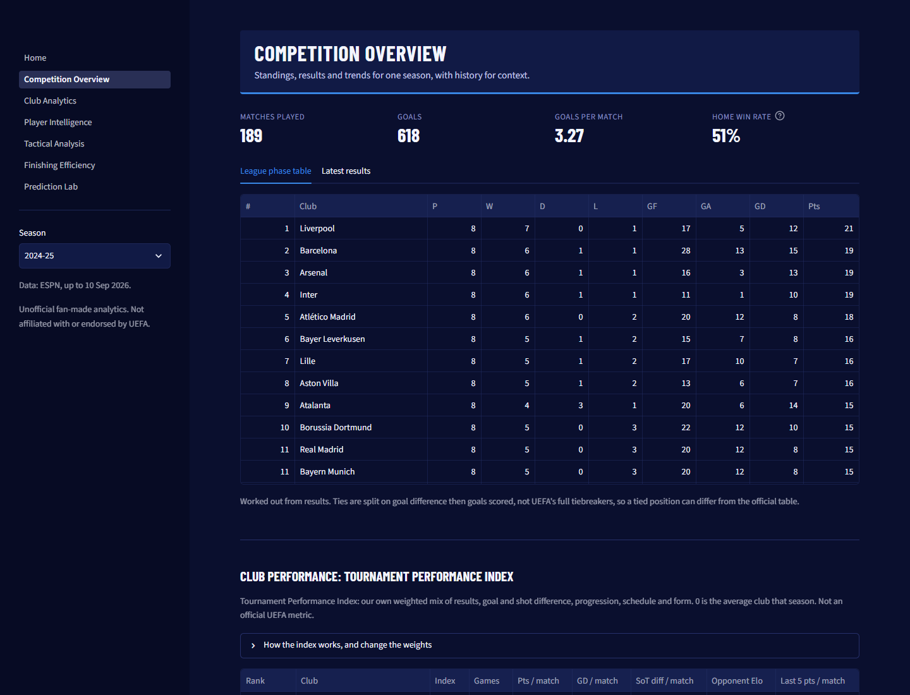
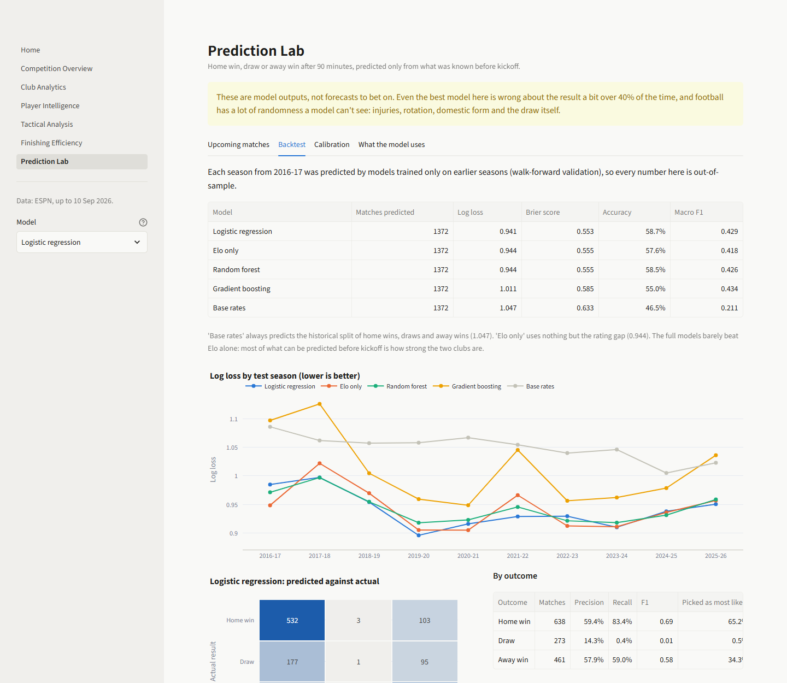

# UCL Analytics

Club and player analysis for the UEFA Champions League, from 2012-13 to the current 2026-27 season.

A Python pipeline pulls every Champions League match from ESPN, checks it, and loads it into PostgreSQL.
A Streamlit dashboard sits on top: standings and trends, club and player breakdowns, style clustering,
finishing analysis, and a match outcome model that's only allowed to use what was known before kickoff.

**Live dashboard: [ucl-analytics.streamlit.app](https://ucl-analytics.streamlit.app/)**
(it runs on a free tier, so the first visit after a quiet spell can take a little while to wake up)



## Why I built it

I wanted a project that goes all the way from messy source data to something people can actually use,
and that forces the awkward decisions real analysis runs into: what to do when a stat you want doesn't
exist, how to tell a missing value from a real zero, and how to test a prediction model without
accidentally letting it see the future.

The Champions League is a good fit because the samples are small. Clubs play 6 to 17 games a season, so
it's easy to over-read a hot streak, and a lot of the work here is about showing how much (or how little)
the numbers can support.

## What's in it

| | |
|---|---|
| Matches | 1,890 finished (every main-tournament game since 2012-13), 90 scheduled |
| Goals | 5,806 |
| Clubs / players | 112 clubs, 4,640 players, 54,942 player-match rows |
| Match events | 27,063 goals, cards, penalties and substitutions |
| SQL | Normalized schema, 4 views, 24 named analytical queries |
| Tests | 137 (pure logic, validation rules, SQL views and incremental updates against a test database, and a smoke test of every page) |

## Tech stack

- **Python**: pandas, NumPy, SciPy, scikit-learn
- **Database**: PostgreSQL 16, SQLAlchemy
- **Validation**: Pandera
- **Dashboard**: Streamlit, Plotly
- **Testing and tooling**: pytest, ruff, Docker Compose, GitHub Actions
- **Hosting**: Supabase (PostgreSQL), Streamlit Community Cloud, a daily GitHub Actions schedule

## Architecture

```text
ESPN site API
   |  scoreboard (fixtures) + summary (box score, lineups, key events)
   v
src/etl/extract.py      raw JSON cached in data/raw/ (finished matches downloaded once)
   v
src/etl/transform.py    flat tables: matches, clubs, players, team stats, player stats, events
   v
src/validation/         Pandera column rules + cross-table checks (keys, duplicates, scores add up,
                        missing-stat detection). Structural problems stop the pipeline.
   v
src/etl/load.py         one transaction: either rebuild everything, or (--update) upsert only
                        new fixtures and newly finished matches
   v
src/models/train.py     Elo ratings, walk-forward backtest, predictions for scheduled matches
   v
PostgreSQL  <---  app/ (Streamlit dashboard), notebooks/, sql/analytics_queries.sql
```

One command runs the whole thing:

```bash
python -m src.etl.run
```

After the first load, `python -m src.etl.run --update` only asks the database which matches it already
has, downloads the new ones (usually a handful of requests) and upserts them by ESPN id, leaving older
seasons untouched. Running the same update twice gives the same result (tested), and rewinding 2026-27 to
before matchday 1 and then updating produced exactly the same rows as a full rebuild. A GitHub Actions workflow runs it every
morning, and every run (including failed ones) is logged in a `pipeline_runs` table.

## Data sources

Everything comes from ESPN's public site API. It's undocumented and not officially supported, so the raw
responses are cached locally and never committed. [DATA_SOURCES.md](DATA_SOURCES.md) lists what it
provides, the known problems, and the other sources I checked and why they weren't used (FBref blocks
automated requests, StatsBomb only has UCL finals, Transfermarkt's dataset has no match stats).

**There's no expected goals (xG) data anywhere in this project.** ESPN doesn't publish it for the
Champions League. Where xG would normally go, the project uses shots and shots on target and says so.

## Database

| Table | One row per |
|---|---|
| `competitions`, `seasons` | competition, season (with format: groups or league phase) |
| `clubs`, `players` | club, player (ESPN id kept for tracing back to the source) |
| `matches` | match: stage, group, leg, score, 90-minute score, extra time, shootout, neutral venue |
| `club_match_stats` | club per match: possession, shots, passes, crosses, tackles, interceptions... |
| `player_match_stats` | player per match they played in: minutes, goals, assists, shots, cards, saves |
| `match_events` | goal, penalty, own goal, card or substitution |
| `club_elo`, `match_predictions`, `model_evaluation` | derived tables written by the model step |
| `pipeline_runs` | every pipeline run: when, full or update, succeeded or failed, how many matches |

Season totals, standings and per-90 rates are **views** (`sql/views.sql`), not tables, so they can't drift
out of sync with the match data. `sql/analytics_queries.sql` has 24 queries, each answering one question
(home advantage by season, comeback wins, results against Elo expectation, rolling form and so on).

## Analytics

- **Per-90 player stats** with a minimum-minutes filter and an exact Poisson interval, because a goal in a
  30-minute cameo isn't a 3.0 goals-per-90 player.
- **Non-penalty numbers**: penalties are taken out of goals, shots and shots on target before any
  finishing comparison.
- **Finishing without xG**: goals compared with what an average finisher would score from the same shots on
  target. It's clearly labelled as ignoring shot quality.
- **Tournament Performance Index**: a custom index (not a UEFA metric) combining points, goal difference,
  shots-on-target difference, stage reached, opponent strength and recent form as within-season z-scores.
  The weights can be changed in the dashboard, and [notebook 02](notebooks/02_club_analysis.ipynb) shows
  the rankings barely move under equal weights.
- **Style clustering**: k-means on eleven standardized team stats from 2018-19 onwards. Two clusters is the
  best silhouette score (0.25), which is weak, so the dashboard describes them as statistical groups and
  not tactical identities.

A few findings from the notebooks:

- Shots on target difference tracks goal difference closely (r = 0.87), but doesn't predict knockout
  results any better than goal difference does.
- From one season to the next, shots per 90 carries over strongly (r = 0.85) and conversion rate barely
  does (r = 0.25). Finishing streaks are mostly noise.
- In 2020-21, played almost entirely without fans, the average home goal margin fell to 0.01, against
  0.23 to 0.65 goals in every other season.

## Machine learning

**Target:** home win, draw or away win **after 90 minutes** (extra time and penalties don't count).

**Features**, all known before kickoff: Elo rating gap, last-five-match form (points, goals, shots on
target for and against), UCL experience, neutral venue, knockout stage, and the first-leg score for
second legs. Form is picked up with `merge_asof(..., allow_exact_matches=False)`, so a match can never
see its own result. There's a test for exactly that, and notebook 05 checks it on the real data.

**Validation:** walk-forward by season. Each season from 2016-17 is predicted by models trained only on
earlier seasons. The Elo settings were tuned on 2013-14 to 2015-16 only, before any test season.

| Model | Log loss | Brier | Accuracy |
|---|---|---|---|
| Logistic regression | 0.941 | 0.553 | 58.7% |
| Elo only | 0.944 | 0.555 | 57.6% |
| Random forest | 0.944 | 0.555 | 58.5% |
| Gradient boosting | 1.011 | 0.585 | 55.0% |
| Base rates | 1.047 | 0.633 | 46.5% |

The simplest reasonable model wins, and only just beats Elo on its own: most of what can be predicted
before kickoff is how strong the two clubs are. Gradient boosting overfits on ~1,400 training matches.
Probabilities are reasonably well calibrated, and draws are almost never the single most likely outcome,
which is normal for football and why log loss matters more than accuracy here.

## Dashboard

| Page | What it shows |
|---|---|
| Competition Overview | Summary, standings, latest results, the performance index with adjustable weights, history |
| Club Analytics | A club's season against the rest, home and away split, opponent strength, Elo over time, every match |
| Player Intelligence | Scoring, creation, shooting, discipline and goalkeeping tables per 90; player comparison |
| Tactical Analysis | Silhouette scores, cluster profiles, a PCA map, closest club profiles, possession against shots faced |
| Finishing & Efficiency | Non-penalty goals against shots on target for players and clubs |
| Prediction Lab | Upcoming match probabilities, backtest scores, confusion matrix, calibration, model coefficients |

A season can be linked directly, e.g. `/Club_Analytics?season=2024`.

Club crests appear in the standings, the performance index table and the club header. They're fetched
from ESPN's image server the first time they're needed and cached locally, not stored in the repository.

The look is a dark navy theme loosely inspired by the Champions League's colours, with condensed headings
(Barlow Condensed, from Google Fonts). It deliberately doesn't use UEFA's logos, starball or typeface:
this is an unofficial fan project and isn't affiliated with or endorsed by UEFA. Chart colours were checked
for colour-blind separation and contrast against the navy background.



## How to run

### With Docker

```bash
cp .env.example .env        # then set a password
docker compose up
```

This starts PostgreSQL, runs the pipeline once, and serves the dashboard at http://localhost:8501.
The first run downloads about 2,000 match summaries from ESPN, which takes around an hour. Later runs only
fetch what's new. If the raw files are already in `data/raw/`, skip ESPN entirely:

```bash
ETL_ARGS=--offline docker compose up
```

### Without Docker

Needs Python 3.12+ and a PostgreSQL database (the `db` service from Docker Compose works fine on its own:
`docker compose up -d db`).

```bash
python -m venv .venv
source .venv/bin/activate          # Windows: .venv\Scripts\activate
pip install -r requirements-dev.txt
cp .env.example .env               # set the database settings

python -m src.etl.run              # or --offline, --update, or --skip-model
python -m streamlit run app/Home.py
```

### Deploying

The live version runs on Supabase, Streamlit Community Cloud and a daily GitHub Actions update.
[docs/deployment.md](docs/deployment.md) walks through it, including the read-only database user the
dashboard connects with.

## Testing

```bash
pytest
```

- Unit tests cover parsing, name and stage cleaning, minutes played, Elo, feature leakage, per-90 maths,
  the index, finishing, clustering helpers, model metrics, and every validation rule (each is broken on
  purpose to make sure it fires).
- `tests/test_sql.py` builds the real schema in a separate `_test` database, loads a small hand-made season
  and checks the views and queries against numbers worked out by hand (no duplicated join rows, NULL
  handling, tiebreakers, a title won on penalties).
- `tests/test_app.py` runs every dashboard page for three seasons. It skips itself if the database is empty.

CI runs the linter, an em dash check, the SQL files against a real PostgreSQL service, and the tests.

## Limitations

- **No xG**, no shot locations, and no progressive passing, pressing or final-third data.
- **No player-level defensive stats**: tackles and interceptions only exist per team.
- **Missing team stats** for some seasons and some single matches. They're stored as NULL, not zero,
  but it means some older seasons can't be compared on those stats. See DATA_SOURCES.md.
- **Minutes are approximate**, worked out from substitution times without added time.
- **Elo only sees Champions League games**, so domestic form is invisible, and clubs new to the
  competition all start from the same rating.
- **Small samples everywhere.** A season is 6 to 17 games per club.
- **ESPN's API is unofficial.** It can change without notice, and it starts refusing requests after a large
  download (the pipeline says so and suggests `--offline`).

## Future improvements

- Cross-check scores and minutes against the Transfermarkt dataset (CC0), which would also add player
  ages and positions.
- Add domestic league results to the Elo ratings so clubs aren't judged on 6 to 17 games a year.
- Use StatsBomb's open event data for the finals it covers, to test how far shots on target is from real xG.
- Model the score (e.g. a Poisson or Dixon-Coles model) instead of just the outcome, which would also give
  draw probabilities a better footing.

## License

The code is MIT licensed. The data belongs to its sources and isn't included in the repository.
